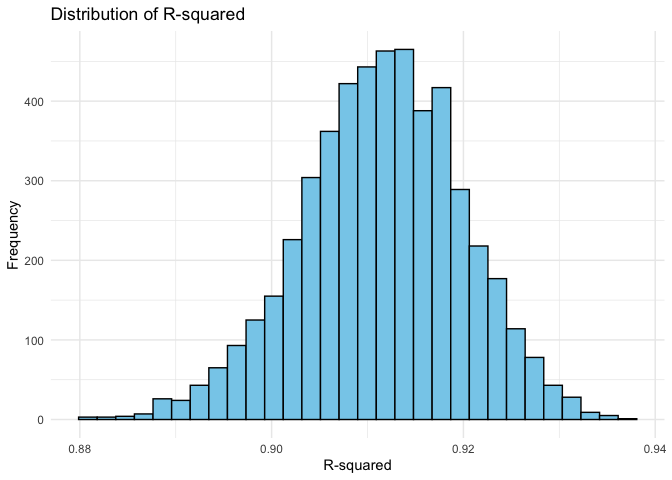
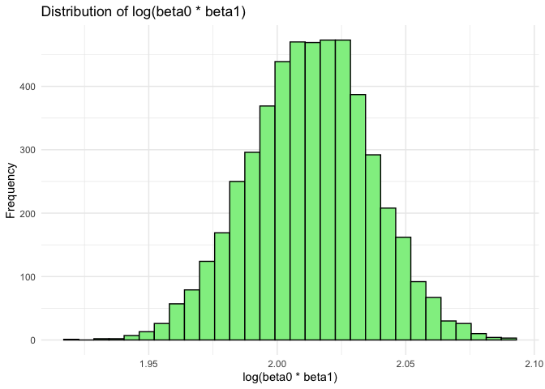
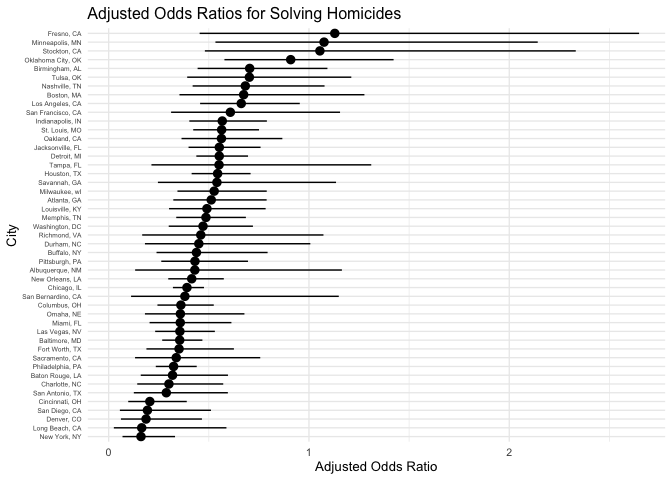
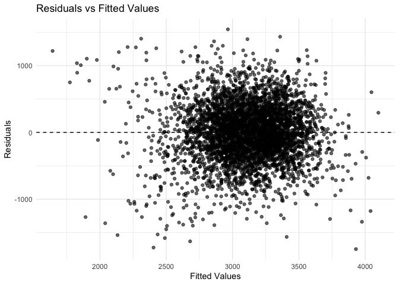
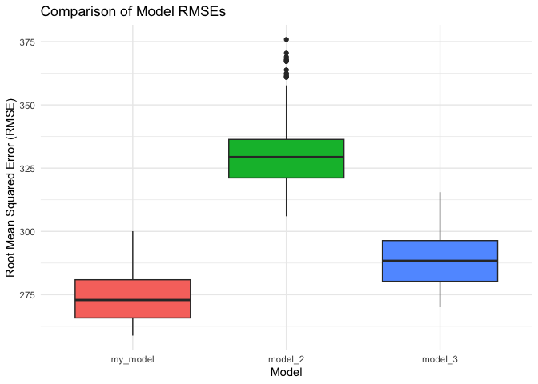

p8105_hw6_ww2744
================
Wenjie Wu

# Problem 1

``` r
weather_df = 
  rnoaa::meteo_pull_monitors(
    c("USW00094728"),
    var = c("PRCP", "TMIN", "TMAX"), 
    date_min = "2017-01-01",
    date_max = "2017-12-31") %>%
  mutate(
    name = recode(id, USW00094728 = "CentralPark_NY"),
    tmin = tmin / 10,
    tmax = tmax / 10) %>%
  select(name, id, everything())
```

    ## using cached file: /Users/wenjiewu/Library/Caches/org.R-project.R/R/rnoaa/noaa_ghcnd/USW00094728.dly

    ## date created (size, mb): 2024-09-26 07:19:26.830591 (8.651)

    ## file min/max dates: 1869-01-01 / 2024-09-30

``` r
bootstrap_samples = bootstraps(weather_df, times = 5000)

calculate_metrics = function(split) {
  data = analysis(split)
  fit = lm(tmax ~ tmin, data = data)
  r_squared = glance(fit)$r.squared
  coefs = tidy(fit)
  beta0 = coefs$estimate[coefs$term == "(Intercept)"]
  beta1 = coefs$estimate[coefs$term == "tmin"]
  log_beta_product = log(beta0 * beta1)
  return(tibble(r_squared = r_squared, log_beta_product = log_beta_product))
}

bootstrap_results = bootstrap_samples |>
  mutate(metrics = map(splits, calculate_metrics)) |>
  unnest(metrics)

bootstrap_summary = bootstrap_results |>
  summarize(
    r2_lower = quantile(r_squared, 0.025),
    r2_upper = quantile(r_squared, 0.975),
    log_beta_lower = quantile(log_beta_product, 0.025),
    log_beta_upper = quantile(log_beta_product, 0.975)
  )

print(bootstrap_summary)
```

    ## # A tibble: 1 × 4
    ##   r2_lower r2_upper log_beta_lower log_beta_upper
    ##      <dbl>    <dbl>          <dbl>          <dbl>
    ## 1    0.894    0.927           1.97           2.06

``` r
ggplot(bootstrap_results, aes(x = r_squared)) +
  geom_histogram(bins = 30, fill = "skyblue", color = "black") +
  labs(title = "Distribution of R-squared", x = "R-squared", y = "Frequency") +
  theme_minimal()
```

<!-- -->

``` r
ggplot(bootstrap_results, aes(x = log_beta_product)) +
  geom_histogram(bins = 30, fill = "lightgreen", color = "black") +
  labs(title = "Distribution of log(beta0 * beta1)", x = "log(beta0 * beta1)", y = "Frequency") +
  theme_minimal()
```

<!-- -->

# Problem 2

``` r
homi_df = read_csv("data/homicide-data.csv")
```

    ## Rows: 52179 Columns: 12
    ## ── Column specification ────────────────────────────────────────────────────────
    ## Delimiter: ","
    ## chr (9): uid, victim_last, victim_first, victim_race, victim_age, victim_sex...
    ## dbl (3): reported_date, lat, lon
    ## 
    ## ℹ Use `spec()` to retrieve the full column specification for this data.
    ## ℹ Specify the column types or set `show_col_types = FALSE` to quiet this message.

``` r
homi_df = homi_df |>
  mutate(city_state = paste(city, state, sep = ", ")) |>
  mutate(solved = ifelse(grepl("Closed", disposition, ignore.case = TRUE), 1, 0))

omit_cities = c("Dallas, TX", "Phoenix, AZ", "Kansas City, MO", "Tulsa, AL")

homi_df = homi_df |>
  filter(!city_state %in% omit_cities) |>
  filter(victim_race %in% c("White", "Black")) |>
  mutate(victim_age = as.numeric(victim_age))
```

    ## Warning: There was 1 warning in `mutate()`.
    ## ℹ In argument: `victim_age = as.numeric(victim_age)`.
    ## Caused by warning:
    ## ! NAs introduced by coercion

``` r
baltimore_data = homi_df |>
  filter(city_state == "Baltimore, MD")

glm_model = glm(solved ~ victim_age + victim_sex + victim_race, 
                 data = baltimore_data, 
                 family = binomial)

summary = broom::tidy(glm_model, conf.int = TRUE, exponentiate = TRUE)
print(summary)
```

    ## # A tibble: 4 × 7
    ##   term             estimate std.error statistic  p.value conf.low conf.high
    ##   <chr>               <dbl>     <dbl>     <dbl>    <dbl>    <dbl>     <dbl>
    ## 1 (Intercept)         1.94    0.174        3.80 1.42e- 4    1.38      2.74 
    ## 2 victim_age          0.995   0.00325     -1.60 1.10e- 1    0.988     1.00 
    ## 3 victim_sexMale      0.355   0.143       -7.26 3.74e-13    0.267     0.468
    ## 4 victim_raceWhite    2.46    0.180        4.99 6.04e- 7    1.73      3.52

``` r
male_female = summary |>
  filter(term == "victim_sexMale") |>
  select(term, estimate, conf.low, conf.high)
print(male_female)
```

    ## # A tibble: 1 × 4
    ##   term           estimate conf.low conf.high
    ##   <chr>             <dbl>    <dbl>     <dbl>
    ## 1 victim_sexMale    0.355    0.267     0.468

``` r
nested_city = homi_df |>
  group_by(city_state) |>
  nest()

city_glm_results = nested_city |>
  mutate(glm_model = map(data, ~ glm(solved ~ victim_age + victim_sex + victim_race,
                                     data = ., family = binomial)),
         tidy_model = map(glm_model, ~ tidy(., conf.int = TRUE, exponentiate = TRUE))) |>
  select(city_state, tidy_model) |>
  unnest(tidy_model) |>
  filter(term == "victim_sexMale") |>
  select(city_state, estimate, conf.low, conf.high) |>
  arrange(estimate) |>
  mutate(city_state = factor(city_state, levels = city_state)) |>
  print()
```

    ## Warning: There were 43 warnings in `mutate()`.
    ## The first warning was:
    ## ℹ In argument: `tidy_model = map(glm_model, ~tidy(., conf.int = TRUE,
    ##   exponentiate = TRUE))`.
    ## ℹ In group 1: `city_state = "Albuquerque, NM"`.
    ## Caused by warning:
    ## ! glm.fit: fitted probabilities numerically 0 or 1 occurred
    ## ℹ Run `dplyr::last_dplyr_warnings()` to see the 42 remaining warnings.

    ## # A tibble: 47 × 4
    ## # Groups:   city_state [47]
    ##    city_state       estimate conf.low conf.high
    ##    <fct>               <dbl>    <dbl>     <dbl>
    ##  1 New York, NY        0.161   0.0691     0.331
    ##  2 Long Beach, CA      0.165   0.0258     0.588
    ##  3 Denver, CO          0.187   0.0613     0.466
    ##  4 San Diego, CA       0.194   0.0560     0.511
    ##  5 Cincinnati, OH      0.206   0.0977     0.390
    ##  6 San Antonio, TX     0.288   0.126      0.595
    ##  7 Charlotte, NC       0.301   0.143      0.572
    ##  8 Baton Rouge, LA     0.319   0.160      0.596
    ##  9 Philadelphia, PA    0.324   0.235      0.440
    ## 10 Sacramento, CA      0.337   0.132      0.757
    ## # ℹ 37 more rows

``` r
ggplot(city_glm_results, aes(x = fct_reorder(city_state, estimate), y = estimate, ymin = conf.low, ymax = conf.high)) +
  geom_pointrange() +
  coord_flip() +
  labs(title = "Adjusted Odds Ratios for Solving Homicides",
       x = "City",
       y = "Adjusted Odds Ratio") +
  theme_minimal(base_size = 10) + 
  theme(axis.text.y = element_text(size = 5))
```

<!-- -->

- The variability in odds ratios across cities highlights differences in
  investigative outcomes，potentially influenced by local factors. The
  top 3 city has the lowest estimate odds ratio is `New York`,
  `Long Beach` and `Denver`.

- Most cities have an OR below 1, indicating that homicides involving
  male victims are generally less likely to be solved compared to female
  victims.

# Problem 3

``` r
birth_weight = read_csv("data/birthweight.csv")
```

    ## Rows: 4342 Columns: 20
    ## ── Column specification ────────────────────────────────────────────────────────
    ## Delimiter: ","
    ## dbl (20): babysex, bhead, blength, bwt, delwt, fincome, frace, gaweeks, malf...
    ## 
    ## ℹ Use `spec()` to retrieve the full column specification for this data.
    ## ℹ Specify the column types or set `show_col_types = FALSE` to quiet this message.

``` r
birth_weight = birth_weight |>
  mutate(
    babysex = as.factor(babysex),
    frace = as.factor(frace),
    mrace = as.factor(mrace),
    malform = as.factor(malform)
  )


sum(is.na(birth_weight))
```

    ## [1] 0

``` r
summary(birth_weight) |>
  knitr::kable()
```

|     | babysex | bhead         | blength       | bwt          | delwt         | fincome       | frace  | gaweeks       | malform | menarche      | mheight       | momage       | mrace  | parity           | pnumlbw   | pnumsga   | ppbmi         | ppwt          | smoken         | wtgain         |
|:----|:--------|:--------------|:--------------|:-------------|:--------------|:--------------|:-------|:--------------|:--------|:--------------|:--------------|:-------------|:-------|:-----------------|:----------|:----------|:--------------|:--------------|:---------------|:---------------|
|     | 1:2230  | Min. :21.00   | Min. :20.00   | Min. : 595   | Min. : 86.0   | Min. : 0.00   | 1:2123 | Min. :17.70   | 0:4327  | Min. : 0.00   | Min. :48.00   | Min. :12.0   | 1:2147 | Min. :0.000000   | Min. :0   | Min. :0   | Min. :13.07   | Min. : 70.0   | Min. : 0.000   | Min. :-46.00   |
|     | 2:2112  | 1st Qu.:33.00 | 1st Qu.:48.00 | 1st Qu.:2807 | 1st Qu.:131.0 | 1st Qu.:25.00 | 2:1911 | 1st Qu.:38.30 | 1: 15   | 1st Qu.:12.00 | 1st Qu.:62.00 | 1st Qu.:18.0 | 2:1909 | 1st Qu.:0.000000 | 1st Qu.:0 | 1st Qu.:0 | 1st Qu.:19.53 | 1st Qu.:110.0 | 1st Qu.: 0.000 | 1st Qu.: 15.00 |
|     | NA      | Median :34.00 | Median :50.00 | Median :3132 | Median :143.0 | Median :35.00 | 3: 46  | Median :39.90 | NA      | Median :12.00 | Median :63.00 | Median :20.0 | 3: 43  | Median :0.000000 | Median :0 | Median :0 | Median :21.03 | Median :120.0 | Median : 0.000 | Median : 22.00 |
|     | NA      | Mean :33.65   | Mean :49.75   | Mean :3114   | Mean :145.6   | Mean :44.11   | 4: 248 | Mean :39.43   | NA      | Mean :12.51   | Mean :63.49   | Mean :20.3   | 4: 243 | Mean :0.002303   | Mean :0   | Mean :0   | Mean :21.57   | Mean :123.5   | Mean : 4.145   | Mean : 22.08   |
|     | NA      | 3rd Qu.:35.00 | 3rd Qu.:51.00 | 3rd Qu.:3459 | 3rd Qu.:157.0 | 3rd Qu.:65.00 | 8: 14  | 3rd Qu.:41.10 | NA      | 3rd Qu.:13.00 | 3rd Qu.:65.00 | 3rd Qu.:22.0 | NA     | 3rd Qu.:0.000000 | 3rd Qu.:0 | 3rd Qu.:0 | 3rd Qu.:22.91 | 3rd Qu.:134.0 | 3rd Qu.: 5.000 | 3rd Qu.: 28.00 |
|     | NA      | Max. :41.00   | Max. :63.00   | Max. :4791   | Max. :334.0   | Max. :96.00   | NA     | Max. :51.30   | NA      | Max. :19.00   | Max. :77.00   | Max. :44.0   | NA     | Max. :6.000000   | Max. :0   | Max. :0   | Max. :46.10   | Max. :287.0   | Max. :60.000   | Max. : 89.00   |

- Firstly, do the data cleaning step, including convert numeric
  variables to factors, checking for missing data etc.

- In modeling process, started with known factors that are hypothesized
  to affect birthweight like `delwt`, `gaweeks`, `smoken`, `fincome` and
  `frace`, these variables were selected based on biological and social
  theories of birth outcomes.

- Use

``` r
birthweight_model = lm(bwt ~ delwt + gaweeks + smoken + fincome + frace, data = birth_weight)

birth_weight = birth_weight |>
  add_predictions(birthweight_model, var = "fitted") |>
  add_residuals(birthweight_model, var = "residuals")

ggplot(birth_weight, aes(x = fitted, y = residuals)) +
  geom_point(alpha = 0.6) +
  geom_hline(yintercept = 0, linetype = "dashed") +
  labs(title = "Residuals vs Fitted Values",
       x = "Fitted Values",
       y = "Residuals") +
  theme_minimal()
```

<!-- -->

``` r
cv_df = crossv_mc(birth_weight, 100) |> 
  mutate(
    train = map(train, as_tibble), 
    test = map(test, as_tibble)
  )

cv_results = cv_df |>
  mutate(
    my_model = map(train, ~ lm(bwt ~ babysex + bhead + blength + delwt + fincome + 
                                   gaweeks + mheight + mrace + parity + ppwt + smoken, data = .x)),
    model_main = map(train, ~ lm(bwt ~ gaweeks + blength, data = .x)),
    model_interaction = map(train, ~ lm(bwt ~ bhead * blength * babysex, data = .x))
  ) |> 
  mutate(
    rmse_my_model = map2_dbl(my_model, test, ~rmse(model = .x, data = .y)),
    rmse_model_2 = map2_dbl(model_main, test, ~rmse(model = .x, data = .y)),
    rmse_model_3 = map2_dbl(model_interaction, test, ~rmse(model = .x, data = .y))
  )
```

    ## Warning: There were 2 warnings in `mutate()`.
    ## The first warning was:
    ## ℹ In argument: `rmse_my_model = map2_dbl(my_model, test, ~rmse(model = .x, data
    ##   = .y))`.
    ## Caused by warning in `predict.lm()`:
    ## ! prediction from rank-deficient fit; attr(*, "non-estim") has doubtful cases
    ## ℹ Run `dplyr::last_dplyr_warnings()` to see the 1 remaining warning.

``` r
cv_results_long = cv_results |>
  select(starts_with("rmse")) |>
  pivot_longer(
    everything(),
    names_to = "model",
    values_to = "rmse",
    names_prefix = "rmse_"
  ) |>
  mutate(model = fct_inorder(model))

ggplot(cv_results_long, aes(x = model, y = rmse, fill = model)) +
  geom_boxplot() +
  labs(
    title = "Comparison of Model RMSEs",
    x = "Model",
    y = "Root Mean Squared Error (RMSE)"
  ) +
  theme_minimal() +
  theme(legend.position = "none")
```

<!-- --> -
`my_model` has the lowest RMSE than `main_effect` model and
`interaction` model.
